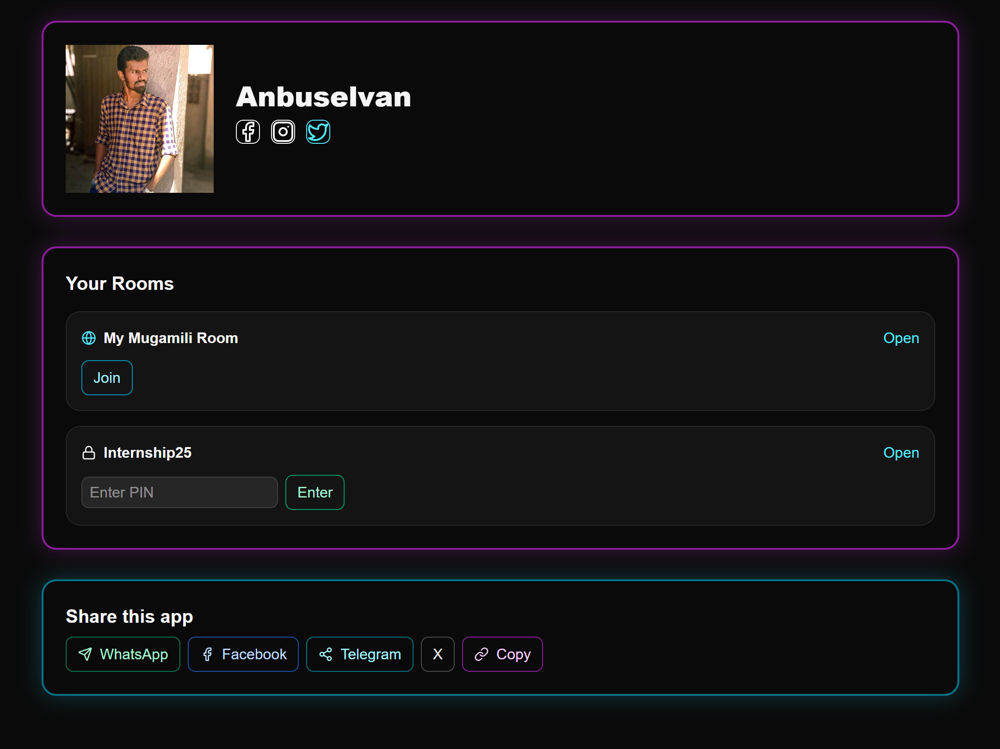

# Mugamili 🎭

A vibrant, anonymous feedback & meme sharing platform built with modern web technologies. Share your thoughts, feedback, and memes in private PIN-protected rooms or public spaces without revealing your identity.

## 📸 Screenshots



## ✨ Features

### Core Functionality

- **🔒 Private Rooms** - PIN-protected spaces for teams, interns, and closed groups
- **🌍 Public Rooms** - Open community rooms for social interaction and meme sharing
- **😊 Anonymous by Default** - All messages are anonymous with optional custom nicknames
- **🖼️ Media Sharing** - Paste direct image/GIF URLs (no file uploads needed)
- **💬 Real-time Chat** - Instant message updates using Firestore listeners
- **🤖 Content Moderation** - Automatic bad-words filtering for safe environment
- **🎨 Modern UI** - Vibrant neon design with smooth animations

### Advanced Features

- **📱 Responsive Design** - Works perfectly on desktop, tablet, and mobile
- **🎬 Smart Image Paste** - Auto-detect image URLs from clipboard
- **📊 Room Metadata** - See who created the room and when
- **🔗 Social Sharing** - Share rooms on WhatsApp, Facebook, Telegram, Twitter, and more
- **⚡ Server Actions** - Secure server-side message handling
- **🔐 Session-based Admin** - Secure admin panel for moderation
- **📡 REST API** - HTTP endpoints for Flutter and other mobile clients

## 🚀 Getting Started

### Prerequisites

- Node.js 18+
- npm or yarn
- Firebase project with Firestore enabled

### Installation

1. **Clone the repository**

```bash
git clone https://github.com/anburocky3/mugamili-anonymous-messaging-app.git
cd mugamili-anonymous-messaging-app
```

2. **Install dependencies**

```bash
npm install
```

3. **Set up environment variables**
   Create a `.env` file in the root directory:

```env
NEXT_PUBLIC_FIREBASE_API_KEY=
NEXT_PUBLIC_FIREBASE_AUTH_DOMAIN=
NEXT_PUBLIC_FIREBASE_PROJECT_ID=
NEXT_PUBLIC_FIREBASE_STORAGE_BUCKET=
NEXT_PUBLIC_FIREBASE_MESSAGING_SENDER_ID=
NEXT_PUBLIC_FIREBASE_APP_ID=
NEXT_PUBLIC_FIREBASE_MEASUREMENT_ID=

ADMIN_PASSWORD=
ADMIN_SESSION_SECRET=
```

4. **Run the development server**

```bash
npm run dev
```

5. **Open the app**
   Navigate to [http://localhost:3000](http://localhost:3000)

## 📋 Tech Stack

- **Framework** - [Next.js 16.2](https://nextjs.org) (App Router + Server Actions)
- **Backend** - [Firebase 12+](https://firebase.google.com) (Firestore ONLY)
- **Styling** - [Tailwind CSS 4](https://tailwindcss.com)
- **Icons** - [Lucide React](https://lucide.dev)
- **Content Filter** - [bad-words 4.0.0](https://npmjs.org/package/bad-words)
- **Language** - [TypeScript 5](https://www.typescriptlang.org)

## 🎮 Usage

### Creating a Room

1. Go to home page
2. Click "Create Room"
3. Enter room name and select type (Public/Private)
4. For private rooms, a 6-digit PIN is auto-generated
5. Share the room ID and PIN with others

### Joining a Room

1. Enter PIN if it's a private room (amber lock icon)
2. Click "Join" or press Enter
3. Enter nickname (optional) or stay anonymous
4. Start sharing!

### Sharing Media

1. Click "Add Media" button in the composer
2. Paste a direct image/GIF URL (e.g., `https://example.com/image.png`)
3. Image preview appears automatically
4. Send the message

### Admin Panel

1. Navigate to `/admin`
2. Login with admin password: `UnKnown` (change in production!)
3. Create rooms, view messages, flag/delete inappropriate content

## 🔄 Real-time Updates

Messages update instantly for all connected users via Firestore `onSnapshot` listeners. The chat automatically scrolls to the latest message.

## 🛡️ Security Features

- **PIN Hashing** - 6-digit PINs are salted and hashed using HMAC-SHA256
- **Content Filtering** - Automatic bad-words detection on nicknames and messages
- **Referrer Policy** - Image tags use `referrerPolicy="no-referrer"` to protect privacy
- **Session Auth** - Admin sessions use signed cookies (HMAC-SHA256)
- **No File Uploads** - Only direct URLs to external images (prevents abuse)

## 🤝 Code Contribution

Contributions are welcome! Here's how to contribute:

1. **Fork the repository**

```bash
git clone https://github.com/anburocky3/mugamili-anonymous-messaging-app.git
cd mugamili-anonymous-messaging-app
```

2. **Create a feature branch**

```bash
git checkout -b feature/amazing-feature
```

3. **Make your changes**

- Follow the existing code style
- Use TypeScript for type safety
- Keep components focused and reusable
- Add comments for complex logic

4. **Test your changes**

```bash
npm run dev
# Test in browser at http://localhost:3000
```

5. **Commit with clear messages**

```bash
git commit -m "feat: add amazing feature"
```

6. **Push to your branch**

```bash
git push origin feature/amazing-feature
```

7. **Open a Pull Request**

- Describe what you changed and why
- Reference any related issues

### Home Page

Clean room list with public/private distinction. Easy PIN entry for private rooms.

### Chat Room

Real-time messages with creator info, creation date, and message count in header. Modern message bubbles with neon styling.

### Media Sharing

Smooth media preview and error handling. Images with rounded corners and cyan glow effects.

### Admin Dashboard

Secure login, room management, message moderation with flag and delete controls.

## 👤 Author

**Anbuselvan**

- GitHub: [@anburocky3](https://github.com/anburocky3)

## 📄 License

This project is licensed under the **MIT License** - see the [LICENSE](LICENSE) file for details.

## 🙏 Acknowledgements

- [Next.js](https://nextjs.org) - React framework
- [Firebase](https://firebase.google.com) - Backend & real-time database
- [Tailwind CSS](https://tailwindcss.com) - Utility-first CSS framework
- [Lucide React](https://lucide.dev) - Beautiful icon library
- [bad-words](https://npmjs.org/package/bad-words) - Content filtering
- [Vercel](https://vercel.com) - Deployment platform

## 🚀 Roadmap

- [ ] User authentication & profiles
- [ ] Message search and filtering
- [ ] Room statistics & analytics
- [ ] Custom room themes
- [ ] Message reactions & emoji support
- [ ] Voice message support
- [ ] Native mobile apps (Flutter)
- [ ] Dark/Light theme toggle

## 💬 Support

For questions, issues, or suggestions:

- Open an [issue](https://github.com/yourusername/mugamili/issues)
- Start a [discussion](https://github.com/yourusername/mugamili/discussions)
- Contact: anbuselvan@example.com

---

**Built with ❤️ using Next.js, Firebase & Tailwind CSS**
